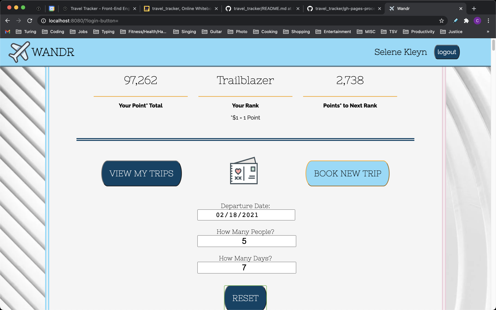

# WANDR - Travel Tracker

## Description

Welcome to WANDR - the app/travel agency that will track your journies across the world while booking you new adventures at the same time. Features on this project include a login page with some basic "authentication", a dashboard that will show a user how much they have spent on travel all-time while using the app (all-time because of the point feature and the corresponding Rank a user will receive based on how much they have spent), the dashboard also includes a list of the trips the user has been on with the trip's details, and another menu where the user can book new trips with specified details.

## Contributors

This project was completed by me, Cole Fiscus, a Mod 2 student at the Turing School of Software & Design. Additional advice and insight was provided by my "accountabilibuddy", Tashia Davis, my mentor, Patrick McLaughlin, and my "Rock", Bailey Dunning.

This project runs on Vanilla JS, CSS/Sass, and HTML. Espcially important too are the fetchAPI calls.

## Setup

To see WANDR in action, follow these directions:

1. Start by cloning down and running the Travel Tracker API.
```zsh 
git clone git@github.com:turingschool-examples/travel-tracker-api.git
npm install
npm start
```
2. Then you will need to clone this project's repo.
```zsh
git clone git@github.com:colefiscus/whatsCookinRefactor.git
npm install
npm start
```
The API should be running on port localhost:3001.
Your application should be running on localhost:8080. To make sure, open localhost:8080 in your browser.

To also run any tests or packages, consult the package.json file first.
Or you can just run the tests using `npm test`, assuming you've already ran `npm install`.

## Action

Here are some images a user will see in sequence of their use of WANDR:





## Bugs / Future Iterations

As it stands right now there's only one issue that I am aware of and that is that the responsiveness of the site starts to fail a bit as you get smaller than a width of 300px. 

For future iterations of this project, the first thing that I would like to handle is improve the error handling. Currently, due to time constraints, if a user needs to be alerted of something a window alert will pop up on their screen. This is not ideal as the alert is supplied by the browser so it is not able to be styled and it also prevents the user from interacting with the page until the alert is dealt with. Instead I would like to add some kind of DOM update when a user triggers an alert which would be much better for the UX.

After that I would move on the Iteration 4 on the project spec sheet (seen below) which entails being able to log in as a travel agent to interact with all users and their possibly pending trip requests among other things.

## Details

The Github for the project creator can be found [here](https://github.com/colefiscus).
The original project spec sheet can be seen [here](https://frontend.turing.io/projects/travel-tracker.html).
Please check back later for a deployed link of the project to access it wherever you go!
